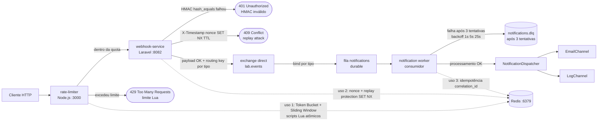

# Backend Engineering Lab

<!-- Substitua YOUR_GITHUB_USER pelo seu usuário ou organização antes de publicar o remoto. -->
[](https://github.com/YOUR_GITHUB_USER/backend-engineering-lab/actions/workflows/notification-service.yml)
[](https://github.com/YOUR_GITHUB_USER/backend-engineering-lab/actions/workflows/webhook-service.yml)
[](https://github.com/YOUR_GITHUB_USER/backend-engineering-lab/actions/workflows/rate-limiter.yml)

Monorepo de portfólio com três serviços integráveis que demonstram filas assíncronas (RabbitMQ), rate limiting com Redis + Lua e recepção segura de webhooks (HMAC, replay protection).

Diagrama detalhado (fonte): [docs/architecture.md](docs/architecture.md). PNG auxiliar: [docs/architecture.png](docs/architecture.png).

### Arquitetura (fluxo)



## Serviços

| Serviço | Stack | Descrição |
|---------|--------|-----------|
| [notification-service](notification-service/) | PHP 8.2, Laravel 11, RabbitMQ, Redis | API de eventos → fila → worker com idempotência e DLQ |
| [rate-limiter](rate-limiter/) | Node 20, Express, Redis | Token bucket + sliding window (Lua), proxy para webhook |
| [webhook-service](webhook-service/) | PHP 8.2, Laravel 11, Redis, RabbitMQ | `POST /webhook/{provider}` com HMAC e publicação na fila |

## Fluxo integrado (demo)

```
Cliente → rate-limiter:3000 → webhook-service → RabbitMQ → notification worker → Email/Log
```

Subir tudo: `docker compose up --build` na raiz. RabbitMQ Management: <http://localhost:15672> (guest/guest).

## Requisitos

- Docker + Docker Compose v2

## Quick start

```bash
cp .env.example .env
docker compose up --build -d
```

Health checks:

- Notification: `GET http://localhost:8081/health`
- Webhook: `GET http://localhost:8082/health`
- Rate limiter: `GET http://localhost:3000/health`

### Swagger / OpenAPI (testar rotas)

| Serviço | UI | Observação |
|---------|----|------------|
| notification-service | [http://localhost:8081/api/documentation](http://localhost:8081/api/documentation) | `composer run docs` para regerar (`require-dev`) |
| webhook-service | [http://localhost:8082/api/documentation](http://localhost:8082/api/documentation) | Idem |
| rate-limiter | [http://localhost:3000/api-docs](http://localhost:3000/api-docs) | Especificação em [/openapi.json](http://localhost:3000/openapi.json) |

Exemplo via rate limiter (webhook atrás do proxy):

```bash
curl -s -X POST http://localhost:3000/webhook/generic \
  -H "Content-Type: application/json" \
  -H "X-Signature: <hmac-sha256-do-body>" \
  -H "X-Timestamp: $(date -u +%s)" \
  -H "X-Nonce: $(uuidgen)" \
  -d '{"event_type":"checkout.session.completed"}'
```

(Consulte [webhook-service/README.md](webhook-service/README.md) para gerar assinatura e headers.)

## Produção (simulação)

```bash
docker compose -f docker-compose.yml -f docker-compose.prod.yml up --build -d
```

## Architecture Decisions

Registros de decisão em [docs/decisions/](docs/decisions/) (índice em [docs/decisions/README.md](docs/decisions/README.md)).

## CI

Workflows GitHub Actions em [.github/workflows/](.github/workflows/) — badges abaixo após primeiro run no remoto.

## Licença

MIT
