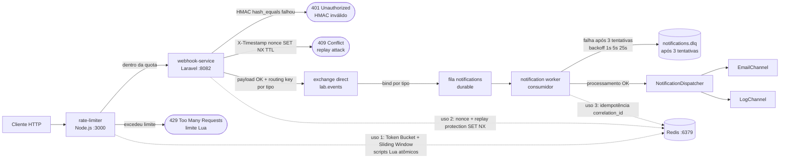

# Arquitetura — Backend Engineering Lab

Visão de fluxo do lab: cliente na borda, **rate-limiter** (Node.js), **webhook-service** (Laravel), **RabbitMQ** (exchange `direct` + fila durável + **DLQ** após 3 tentativas), **notification worker** e dispatch para canais. O **Redis** aparece como um único cluster lógico com três usos marcados pelas etiquetas das arestas.

## Legenda

| Elemento | Porta / interface | Responsabilidade |
|----------|-------------------|------------------|
| **Cliente** | — | Envia `POST` (ex.: `/webhook/{provider}`) via proxy do rate-limiter. |
| **rate-limiter** | `3000` (público no compose) | Express; limita com **Token Bucket** e **Sliding Window** (Lua + `EVALSHA`); proxy de `/webhook/*` para o upstream configurado. Responde **429** quando bloqueado. |
| **webhook-service** | `8082` (host; `8080` no container) | Laravel; corpo bruto para HMAC; valida assinatura (**401** se inválida); **replay** com janela de timestamp + **nonce** em Redis (**409** se duplicado); persiste auditoria; publica no broker com **routing key** por tipo de evento. |
| **RabbitMQ** | `5672` (AMQP), `15672` (Management UI) | **Exchange** `direct` (`lab.events`); fila durável `notifications`; mensagens que esgotam **3 tentativas** no worker vão para **DLQ** (`notifications.dlq`). |
| **notification worker** | — (processo `notifications:consume`) | Consome a fila `notifications`; retries com backoff; marca idempotência por `correlation_id` no **Redis**; despacha canais. |
| **notification-service API** | `8081` (host) | `POST /api/events` (fluxo alternativo do lab) também publica no mesmo contrato de exchange/filas; não aparece no ramo principal do diagrama acima. |
| **NotificationDispatcher** | — | Encaminha o resultado do handler para **EmailChannel** (mock) ou **LogChannel**. |
| **Redis** | `6379` | Uso **(1)** buckets no rate-limiter; **(2)** nonce anti-replay no webhook; **(3)** idempotência no worker/aplicação de notificação. |

Arquivo PNG legado (placeholder visual): [architecture.png](architecture.png).
